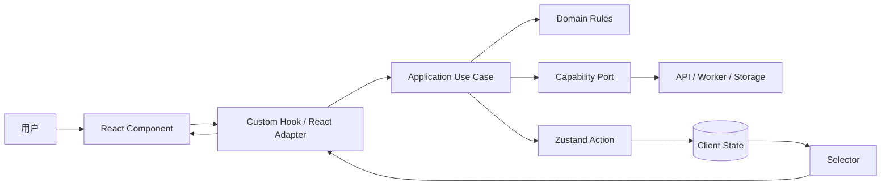
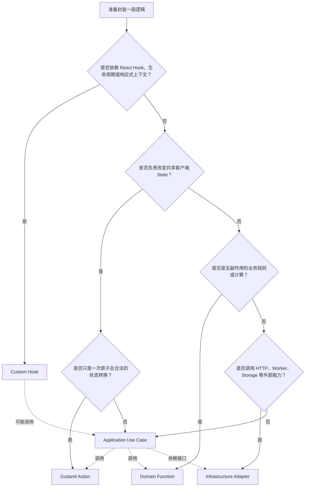
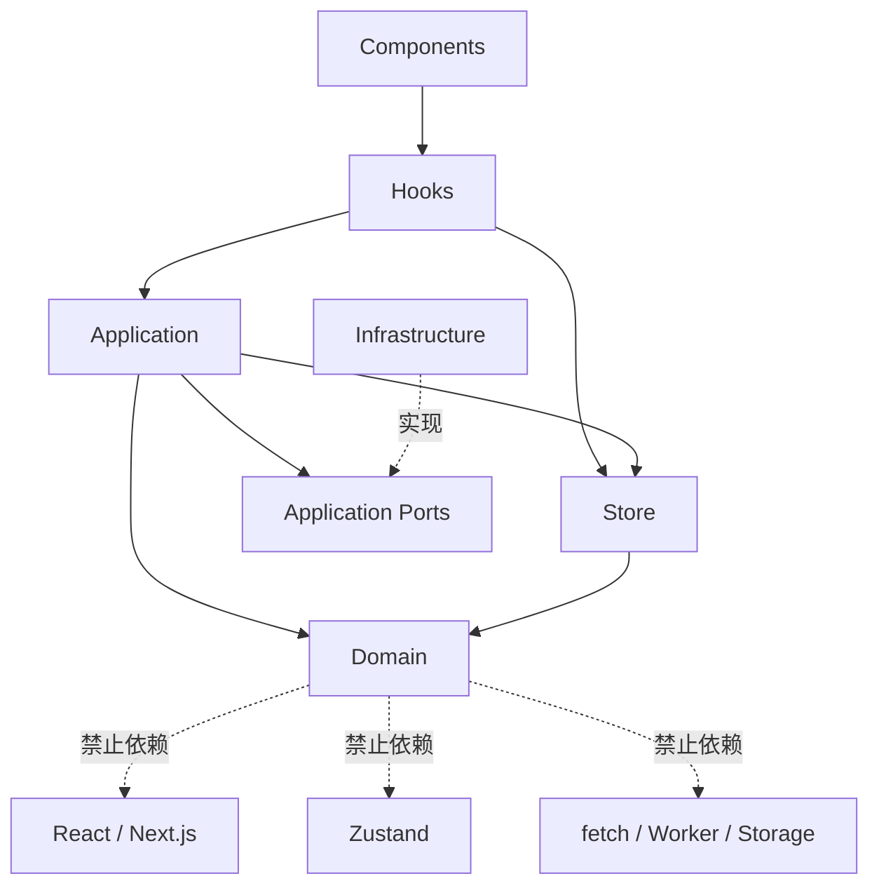
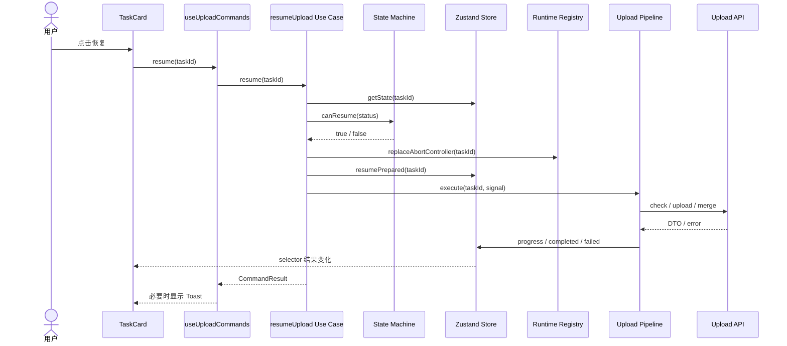

# 前端业务逻辑与状态分层工程实践指南

> 适用范围：React、Next.js 与 Zustand 项目，尤其适合包含状态机、异步任务、并发控制、重试、取消、缓存或跨页面流程的中大型前端工程。

## 1. 这篇指南要解决什么问题？

前端项目从页面演示发展为生产系统后，业务逻辑通常会逐渐散落到以下位置：

- React 组件和事件处理函数；
- 自定义 Hooks；
- Zustand Action；
- `lib/`、`services/`、`utils/` 中的普通 TypeScript 文件；
- API Client、Web Worker、浏览器存储等基础设施代码。

真正的问题不是“哪一种写法最好”，而是：

1. 这段逻辑由谁拥有？
2. 它是否依赖 React 的渲染和生命周期？
3. 它是否负责修改共享客户端状态？
4. 它是在表达业务规则，还是在编排多个步骤？
5. 它是否依赖 HTTP、Worker、Storage 等外部能力？
6. 离开组件和 Zustand 后，它能否独立测试与复用？

本文先给出结论，再逐层解释如何划分。

## 2. 核心结论：不同逻辑应该放在哪里？

| 逻辑类型 | 推荐位置 | 核心职责 |
| --- | --- | --- |
| 组件展示与局部交互 | React 组件 / `useState` | 渲染 UI、接收输入、发出用户意图 |
| React 生命周期与浏览器订阅 | 自定义 Hook | 连接 React 与外部系统，管理 Effect 的建立和清理 |
| 共享客户端状态转换 | Zustand Action | 保证 State 如何合法地从旧状态变成新状态 |
| 纯业务规则 | `domain/*.ts` | 校验、计算、状态转换判断，不依赖 React、Store 或网络 |
| 多步骤业务流程 | `application/*.ts` 或 `use-cases/*.ts` | 编排 Store、领域规则、API、Worker、重试与取消 |
| HTTP、Worker、Storage 等实现 | `infrastructure/*.ts` | 封装外部系统和技术细节，实现应用层定义的能力接口 |
| 共享状态的读取与派生 | Zustand selector | 从 State 中选择或计算 UI 所需数据 |

一句话记忆：

```text
Hook 负责“接入 React”
Action 负责“改变共享状态”
Domain 负责“业务规则”
Application 负责“完成一个用例”
Infrastructure 负责“调用外部能力”
Component 负责“展示并表达用户意图”
```

一项完整业务往往会同时经过这些层，而不是只能归入其中一层。



依赖方向应尽量从 UI 指向业务内核。领域规则不应该反过来导入 React、Zustand 或具体的 `fetch` 实现。

## 3. 先划分数据，再划分逻辑

业务逻辑难以归位，通常是因为数据所有权还没有确定。建议先把前端接触的数据分成四类。

### 3.1 组件局部 UI State

例如：

- 下拉菜单是否展开；
- 当前输入框草稿；
- 鼠标是否悬停；
- 某张卡片的删除确认框是否打开。

这类状态生命周期与组件一致，优先使用 `useState` 或 `useReducer`。如果只是多个组件复用相同的状态逻辑，可以提取自定义 Hook，但每次调用 Hook 仍然拥有独立状态。

```tsx
function useDisclosure(initialOpen = false) {
  const [open, setOpen] = useState(initialOpen);

  return {
    open,
    show: () => setOpen(true),
    hide: () => setOpen(false),
  };
}
```

自定义 Hook 复用的是“如何管理状态”的逻辑，不会自动让两个组件共享同一份状态。

### 3.2 共享客户端 State

例如：

- 多个组件共同查看的上传任务；
- 客户端工作流当前阶段；
- 跨页面仍需保留的编辑器草稿；
- 客户端任务的暂停、重试和选择状态。

这类数据适合由 Zustand Store 统一拥有。组件通过 selector 订阅，所有写入通过有语义的 Action 完成。

### 3.3 服务端 State 与持久化事实

例如：

- 数据库中的订单；
- 服务端保存的上传分片；
- 用户权限；
- 服务端任务真实执行状态。

这类数据的权威来源在服务端。前端可以保存视图投影、缓存或乐观更新状态，但不能让 Zustand 中的一份副本成为最终事实。

对于普通查询数据，可使用 Server Component、框架的数据缓存或专门的请求缓存方案。不要仅仅为了“全局可访问”就把全部 API 响应复制进 Zustand。

### 3.4 运行时句柄

例如：

- `AbortController`；
- `Worker` 实例；
- WebSocket 连接；
- 定时器 ID；
- 大文件 `File` 引用。

它们通常不可序列化，也不属于可持久化业务事实。小型项目可以把部分句柄放在 Store 中简化实现；生产项目更适合由专门的 runtime registry、service 实例或 Hook 的 `ref` 管理，并在 Store 中只保存稳定 ID 和可展示状态。

```text
Store：taskId、status、progress、error
Runtime Registry：taskId → AbortController / Worker / in-flight Promise
```

## 4. 哪些逻辑应该放在自定义 Hooks？

[React 官方文档](https://react.dev/learn/reusing-logic-with-custom-hooks)将自定义 Hook 定位为组件之间复用有状态逻辑的方式。工程上更准确的理解是：Hook 是 React 与业务能力之间的适配层。

### 4.1 适合放入 Hook 的逻辑

#### 依赖 React Hook 或生命周期

- 使用 `useState`、`useReducer`、`useRef`；
- 建立并清理 `useEffect`；
- 使用 `useSyncExternalStore`、Context 或框架客户端 Hook；
- 组件挂载时订阅网络、媒体查询、键盘或浏览器事件；
- 卸载时取消订阅、释放资源。

```tsx
export function useOnlineStatus(): boolean {
  const [online, setOnline] = useState(() => navigator.onLine);

  useEffect(() => {
    const handleOnline = () => setOnline(true);
    const handleOffline = () => setOnline(false);

    window.addEventListener("online", handleOnline);
    window.addEventListener("offline", handleOffline);

    return () => {
      window.removeEventListener("online", handleOnline);
      window.removeEventListener("offline", handleOffline);
    };
  }, []);

  return online;
}
```

#### 组合多个响应式来源供组件消费

Hook 可以组合 Zustand selector、Context、路由参数和组件局部状态，并返回适合 UI 使用的视图模型。

```tsx
export function useUploadSummary() {
  const activeCount = useUploadStore(selectActiveCount);
  const failedCount = useUploadStore(selectFailedCount);
  const online = useOnlineStatus();

  return {
    activeCount,
    failedCount,
    canStartUpload: online && activeCount < 10,
  };
}
```

#### 提供 React 友好的业务命令入口

Hook 可以把应用层用例适配成组件容易调用的函数，并处理仅属于 UI 的反馈，例如 Toast、对话框或路由跳转。

```tsx
export function useUploadCommands() {
  const uploadService = useUploadService();

  const resume = useCallback(
    async (taskId: string) => {
      const result = await uploadService.resume(taskId);

      if (!result.ok) {
        toast.error(result.message);
      }
    },
    [uploadService],
  );

  return { resume };
}
```

这里的 Hook 负责 React 环境和 UI 反馈；真正的恢复规则与流程仍在应用层。

### 4.2 不适合放入 Hook 的逻辑

- 不依赖 React 的文件分片计算；
- 可独立执行的上传重试算法；
- 业务状态机的合法转换判断；
- API 请求和响应解析；
- 与 UI 无关的多步骤工作流；
- 为了复用普通函数而强行添加 `use` 前缀。

下面的 Hook 承担了过多职责：

```tsx
// 不推荐：网络、重试、状态转换、Toast 和 React 生命周期全部耦合在一起。
function useUploadTask(file: File) {
  useEffect(() => {
    // 计算 hash
    // 调用 check API
    // 创建并发池
    // 重试分片
    // 修改共享任务状态
    // 显示 Toast
  }, [file]);
}
```

这种实现只能在 React 中运行，难以在单元测试、命令式事件或后台流程中复用，也容易受到 Effect 重执行和依赖数组变化的影响。

### 4.3 Hook 的评审问题

- 去掉 React 后，这段逻辑是否仍有业务意义？如果有，应把业务内核移到普通 TS 文件；
- Hook 是否只负责订阅、生命周期、响应式组合和 UI 适配？
- Effect 是否在同步外部系统，而不是用来模拟普通事件处理？
- 清理函数是否能够释放监听、连接、Worker 或请求？
- Hook 返回的是稳定、明确的视图数据和命令，还是暴露了整套底层实现？
- 多个互不相关、依赖不同的 Effect 或计算是否应该拆成更小的 Hook？
- 某个 State 是否只在点击回调中读取？如果 UI 不依赖它渲染，应考虑在命令执行时读取最新值，而不是让组件持续订阅。

## 5. 哪些逻辑应该放在 Zustand Action？

Zustand Action 是 Store 的写入边界。它最重要的职责不是“放业务函数”，而是确保共享 State 只能按合法方式变化。

### 5.1 适合放入 Action 的逻辑

#### 原子状态转换

一次调用完成一个不可再分的状态变化：

```ts
pauseTask: (taskId) =>
  set((state) => {
    const task = state.tasks.get(taskId);

    if (!task || !canPause(task.status)) {
      return state;
    }

    return {
      tasks: replaceTask(state.tasks, taskId, {
        ...task,
        status: "paused",
      }),
    };
  });
```

#### 维护 State 不变量

例如：

- 并发数必须处于 `1..8`；
- 已完成任务不能再次进入上传中；
- 上传进度必须处于 `0..1`；
- 删除任务时必须同步清除选中状态；
- 一个 Action 修改多个强相关字段，避免中间非法状态被观察到。

#### Store 内部数据的增删改

- `addTask`、`removeTask`；
- `markChunkUploaded`；
- `setProgress`；
- `setError`；
- `reset`。

这些 Action 应使用业务含义命名，而不是暴露 `setTaskField(name, value)` 这类万能修改入口。

### 5.2 Action 中可以执行异步逻辑吗？

Zustand 允许异步 Action，但“框架允许”不等于“复杂业务都应放进去”。

适合直接放入异步 Action 的情况：

- 流程短小，只影响一个 Store；
- 依赖少，通常只有一个 API；
- 不涉及复杂取消、并发、补偿、重试或跨领域协作；
- 测试时可以轻松替换依赖。

更适合放到应用层用例的情况：

- 跨越多个状态阶段；
- 调用多个 API 或 Worker；
- 涉及并发池、超时、重试和取消；
- 同时协调多个 Store 或领域；
- 需要在 React 之外启动；
- 需要独立的集成测试和可观测性。

生产项目中，可以把 Action 收敛为明确的状态提交接口：

```ts
interface UploadActions {
  taskAdded: (task: UploadTaskState) => void;
  hashProgressed: (taskId: string, progress: number) => void;
  uploadStarted: (taskId: string) => void;
  chunkUploaded: (taskId: string, chunkIndex: number) => void;
  uploadFailed: (taskId: string, error: UploadError) => void;
  uploadCompleted: (taskId: string, result: UploadResult) => void;
}
```

应用层负责决定何时调用这些 Action；Action 负责保证提交后的 State 正确。

### 5.3 Action 不应承担什么？

- 不应渲染 Toast、打开弹窗或执行路由跳转；
- 不应依赖组件是否挂载；
- 不应读取 DOM；
- 不应包含无法替换的具体 API、Worker 或 Storage 初始化；
- 不应成为包含所有业务规则和流程的“上帝对象”；
- 不应把整个 Store 通过通用 setter 开放给任意调用方修改。

### 5.4 Action 与领域规则的关系

Action 可以调用纯领域函数，但领域函数不应导入 Store：

```ts
// domain/upload-state-machine.ts
export function canTransition(from: TaskStatus, to: TaskStatus): boolean {
  return allowedTransitions[from].includes(to);
}
```

```ts
// store/upload-store.ts
transitionTask: (taskId, nextStatus) =>
  set((state) => {
    const task = state.tasks.get(taskId);
    if (!task || !canTransition(task.status, nextStatus)) return state;

    return {
      tasks: replaceTask(state.tasks, taskId, {
        ...task,
        status: nextStatus,
      }),
    };
  });
```

这样，同一状态机规则可以被 Store、用例测试和服务端协议校验共同理解，而不会被锁在 Zustand 内部。

## 6. 哪些逻辑应该放在普通业务逻辑文件？

“放在 `lib/`”仍然太宽泛。生产项目至少应进一步区分 Domain、Application 和 Infrastructure。

### 6.1 Domain：纯业务规则

Domain 描述与 React、Zustand、HTTP 无关的业务知识。

典型内容：

- 状态机与合法转换；
- 文件分片范围计算；
- 是否允许暂停、恢复或重试；
- 进度计算；
- 输入校验；
- 错误分类与策略判断；
- 领域对象和稳定值类型。

```ts
export function getChunkRange(
  fileSize: number,
  chunkSize: number,
  index: number,
): { start: number; end: number } {
  const start = index * chunkSize;
  const end = Math.min(start + chunkSize, fileSize);

  if (start >= fileSize || index < 0) {
    throw new RangeError("分片索引超出文件范围");
  }

  return { start, end };
}
```

优质 Domain 函数具有以下特征：

- 输入和输出明确；
- 相同输入得到相同输出；
- 不访问全局变量；
- 不发送请求；
- 不直接修改 Store；
- 可使用普通单元测试覆盖边界条件。

### 6.2 Application / Use Case：业务流程编排

Application 层负责完成一个用户可感知的用例，例如“开始上传”“恢复上传”“取消订单”“提交编辑结果”。

它可以：

- 调用 Domain 规则；
- 调用 API、Worker、Storage 等能力接口；
- 调用 Zustand Action 提交状态；
- 组织步骤顺序；
- 处理取消、重试、回滚或补偿；
- 记录业务级日志和指标；
- 返回结构化结果给 UI。

```ts
interface UploadDependencies {
  store: UploadStoreApi;
  api: UploadApi;
  hasher: FileHasher;
  runtime: UploadRuntimeRegistry;
  logger: Logger;
}

export function createUploadUseCases(deps: UploadDependencies) {
  return {
    async resume(taskId: string): Promise<CommandResult> {
      const task = deps.store.getState().tasks.get(taskId);

      if (!task || !canResume(task.status)) {
        return { ok: false, code: "TASK_NOT_RESUMABLE" };
      }

      const signal = deps.runtime.replaceAbortController(taskId).signal;
      deps.store.getState().resumePrepared(taskId);

      try {
        await executeUploadPipeline(taskId, signal, deps);
        return { ok: true };
      } catch (error) {
        const failure = classifyUploadError(error);
        deps.store.getState().uploadFailed(taskId, failure);
        deps.logger.error("upload.resume.failed", { taskId, failure });
        return { ok: false, code: failure.code };
      }
    },
  };
}
```

这里通过依赖参数注入能力，而不是在用例内部直接导入单例。测试时可以提供 Fake Store、Fake API 和 Fake Hasher。

### 6.3 Infrastructure：外部能力适配

Infrastructure 负责回答“具体怎样调用某种技术能力”：

- `fetch` 请求如何构造；
- API DTO 如何解析；
- Web Worker 怎样创建和通信；
- IndexedDB 如何读写；
- WebSocket 如何连接；
- 日志、埋点和监控 SDK 如何调用。

```ts
export interface UploadApi {
  check(input: CheckInput, signal: AbortSignal): Promise<CheckResult>;
  uploadChunk(input: ChunkInput, signal: AbortSignal): Promise<void>;
  merge(input: MergeInput, signal: AbortSignal): Promise<MergeResult>;
}

export const httpUploadApi: UploadApi = {
  async check(input, signal) {
    const response = await fetch("/api/upload/check", {
      method: "POST",
      body: JSON.stringify(input),
      signal,
    });

    return parseCheckResponse(response);
  },
  // uploadChunk 与 merge 省略……
};
```

Application 依赖 `UploadApi` 接口，不关心它使用 `fetch`、Mock Server 还是原生客户端桥接。

## 7. 决策树：拿到一段逻辑后怎样判断？



注意：如果一段代码同时回答多个问题，不要纠结选哪个文件，而应把它拆开。

例如“点击恢复上传”至少包含：

1. React 按钮事件：Component；
2. Toast 或路由反馈：Hook / UI；
3. 判断任务是否可恢复：Domain；
4. 把任务转换为准备恢复状态：Zustand Action；
5. 创建新的取消控制器并执行 pipeline：Application；
6. 请求服务端检查已上传分片：Infrastructure。

## 8. 用 `next-upload` 分析当前做法

### 8.1 当前划分中做得合理的部分

| 当前文件 | 当前职责 | 评价 |
| --- | --- | --- |
| `lib/upload/store.ts` | 上传 State、用户 Action、pipeline 内部 Action、selector | 已建立单一客户端状态源 |
| `lib/upload/pipeline.ts` | hash → check → upload → merge、并发池、重试 | 已把复杂流程移出组件和 Hook |
| `lib/upload/api.ts` | HTTP 请求与响应错误 | 已隔离网络协议细节 |
| `lib/upload/hash-worker-client.ts` | Worker 生命周期与消息转换 | 已隔离浏览器 Worker 细节 |
| React Components | 展示状态、接收用户操作 | 总体保持了 UI 职责 |

对教学项目而言，这套结构清晰且足够直接。它也证明了一个重要原则：复杂上传 pipeline 不需要为了“React 复用”而写成 Hook。

### 8.2 面向大型生产项目时的局限

#### UI 知道操作顺序

当前 UI 需要先调用 `resumeTask(id)`，再调用 `runTask(id)`：

```ts
resumeTask(task.id);
void runTask(task.id);
```

这意味着组件知道“恢复状态”和“重新启动 pipeline”的协议。如果其他入口也要恢复任务，就会重复这套顺序，并可能漏掉其中一步。

生产级做法是提供一个应用层命令：

```ts
await uploadCommands.resume(task.id);
```

由该命令保证状态准备、runtime 创建、pipeline 启动、错误记录和结果返回的完整顺序。

#### Pipeline 直接依赖具体 Store 单例

`pipeline.ts` 直接导入 `useUploadStore`，实现简单，但让 pipeline 难以替换 Store 或构造隔离测试实例。

规模扩大后可改为依赖接口或显式参数：

```ts
await executeUploadPipeline({
  taskId,
  store,
  api,
  hasher,
  signal,
});
```

#### Store 同时保存业务状态与运行时句柄

当前任务中包含 `File` 和 `AbortController`。这适合浏览器演示，但会限制持久化、跨 Tab 恢复、SSR 初始化和状态快照调试。

生产项目可拆为：

```ts
interface UploadTaskState {
  id: string;
  fileName: string;
  fileSize: number;
  status: TaskStatus;
  progress: number;
  error: UploadError | null;
}

interface UploadRuntime {
  file: File;
  abortController: AbortController;
}
```

Store 保存可观察状态，Runtime Registry 以 `taskId` 保存临时句柄。

#### `_action` 只是命名约定

`_setStatus` 表示内部 Action，但 TypeScript 调用方仍然可以访问它。生产项目可以通过更窄的接口、Store factory 或 Facade，仅向 UI 暴露允许调用的公开命令。

#### `lib/upload/` 承担了过多层次

当上传域继续增加秒传策略、断点恢复、持久化、后台同步和埋点后，所有文件平铺在 `lib/upload/` 会逐渐失去边界。应按职责而不是按文件类型继续拆分。

## 9. 推荐的生产级目录结构

以下结构不是必须一次性建立，而是复杂度出现后可以演进的目标：

```text
features/upload/
├── domain/
│   ├── upload-types.ts
│   ├── upload-state-machine.ts
│   ├── chunk-policy.ts
│   └── upload-errors.ts
├── application/
│   ├── upload-ports.ts
│   ├── create-upload-use-cases.ts
│   └── execute-upload-pipeline.ts
├── infrastructure/
│   ├── http-upload-api.ts
│   ├── browser-file-hasher.ts
│   ├── upload-runtime-registry.ts
│   └── indexed-db-upload-repository.ts
├── store/
│   ├── create-upload-store.ts
│   ├── upload-actions.ts
│   └── upload-selectors.ts
├── hooks/
│   ├── use-upload-tasks.ts
│   ├── use-upload-summary.ts
│   └── use-upload-commands.ts
├── components/
│   ├── upload-dropzone.tsx
│   ├── upload-task-card.tsx
│   └── upload-task-list.tsx
└── index.ts
```

推荐依赖方向：



图中的虚线“禁止依赖”表示领域层不应导入这些技术实现。

### 可选的对外出口

如果 `upload` 是可独立发布或需要严格隐藏内部实现的模块，可以通过 `features/upload/index.ts` 控制少量稳定的公开能力：

```ts
export { UploadDropzone } from "./components/upload-dropzone";
export { UploadTaskList } from "./components/upload-task-list";
export { useUploadSummary } from "./hooks/use-upload-summary";
export type { UploadTaskState } from "./domain/upload-types";
```

不要把内部 Action、具体 API Adapter 和 Runtime Registry 全部导出。模块边界不仅由目录决定，也由出口决定。

如果这些代码只在同一个应用内部使用，优先从具体文件直接导入，避免建立会聚合大量模块的通用 barrel file。确需公共入口时，应使用少量显式导出，避免 `export *` 把整个 feature 的组件和基础设施都拉入同一模块图。

## 10. 一条生产级上传流程应该怎样流转？

以“用户恢复一个暂停任务”为例：



各层回答的问题分别是：

- Component：用户做了什么？
- Hook：怎样接入 React 和 UI 反馈？
- Use Case：完成“恢复上传”需要哪些步骤？
- Domain：当前状态是否允许恢复？
- Action：共享 State 应怎样原子变化？
- Runtime：新的取消句柄保存在哪里？
- Pipeline：上传阶段怎样推进？
- Infrastructure：具体怎样与服务端通信？

## 11. 状态机应该放在哪里？

复杂业务经常同时包含“状态机规则”和“状态机当前状态”，两者不要混淆：

```text
Domain：允许从 paused 转到 checking，不允许从 completed 转到 uploading
Store：任务 A 当前是 paused
Application：恢复任务 A 时先校验，再准备 runtime，最后启动 pipeline
```

建议：

- 状态枚举与合法转换规则放在 Domain；
- 每个实体的当前状态放在 Store 或服务端权威数据中；
- 状态写入由 Action 执行；
- 跨多个状态的流程由 Application 编排；
- UI 只根据状态决定展示，不自行发明转换规则。

这样能避免 `TaskCard`、Store 和 pipeline 各自维护一套不同的 `if (status === ...)` 规则。

## 12. 错误、取消、重试与副作用怎样分层？

### 错误

- Infrastructure 把 HTTP、Worker 等技术错误转换为稳定的应用错误；
- Domain 判断某类错误是否可重试；
- Application 决定重试、失败、补偿和记录指标；
- Action 把结构化错误写入 State；
- Hook / UI 决定怎样展示给用户。

### 取消

- Runtime 层拥有 `AbortController` 等取消句柄；
- Application 发起取消并编排清理；
- Action 把任务状态转换为 `paused` 或 `cancelled`；
- Infrastructure 接收 `AbortSignal`，不要私自创建无法被上层控制的信号。

### 重试

- Domain 定义哪些错误可重试、最大次数或退避参数；
- Application / pipeline 执行重试循环；
- Action 只记录 attempt、状态和最终错误；
- UI 不实现 `setTimeout` 重试算法。

### Toast、Dialog 与导航

它们属于展示副作用，通常放在 Component 或 Hook。Store Action 和 Domain 不应直接调用 Toast 或路由。

## 13. Server Component、Server Function 与客户端 Store 的边界

Next.js App Router 默认使用 Server Component；状态、事件处理、Effect、浏览器 API 和自定义 Hook 属于 Client Component 能力。可参考 [Next.js 的 Server 与 Client Components 指南](https://nextjs.org/docs/app/getting-started/server-and-client-components)。

建议遵守：

- 数据库、密钥、权限校验和服务端权威写入留在服务端；
- Server Component 可以获取数据并把可序列化的初始视图传给客户端；
- Zustand 不作为跨请求共享的服务端用户状态容器；
- Client Component 只在确实需要交互、Hook 或浏览器 API 的边界声明 `"use client"`；
- 客户端用例通过 Route Handler、Server Function 或后端 API 发起权威变更；
- 服务端结果回到客户端后，再更新或修复本地 Store 投影。

不要因为某个深层工具文件包含 `"use client"`，就默认把整个业务域都设计成 React 客户端逻辑。Domain 中的纯函数应尽量保持跨环境可用。

## 14. 测试策略应与分层对应

| 层 | 主要测试内容 | 推荐方式 |
| --- | --- | --- |
| Domain | 边界值、状态转换、计算规则 | 大量快速单元测试 |
| Zustand Action | 不可变更新、State 不变量、selector | Store 实例测试 |
| Application | 步骤顺序、失败、取消、重试、补偿 | 注入 Fake Port 的用例测试 |
| Infrastructure | DTO、HTTP 状态、Worker 消息、存储兼容性 | 合约或集成测试 |
| Hook | Effect 清理、响应式组合、UI 适配 | React Hook / 组件测试 |
| Component | 用户交互和可见结果 | Testing Library / E2E |

如果一条纯业务规则只能通过渲染组件才能测试，通常说明它被放得太靠近 UI。如果测试 Action 必须真实发送网络请求，通常说明 Store 与 Infrastructure 耦合过深。

## 15. 常见反模式

### 万能 Hook

一个 `useBusiness()` 同时请求数据、修改 Store、管理弹窗、执行重试和返回几十个字段。应拆出用例、selector 与小型 React Adapter。

### 万能 Store

把所有页面、请求缓存、临时表单、连接句柄和服务端数据都放进一个 Zustand Store。应按业务域和生命周期拆分所有权。

### 贫血 Action

只提供 `setState(partial)` 或 `updateTask(id, patch)`，让组件决定任意状态转换。应提供 `pauseTask`、`uploadCompleted` 等语义化 Action，并在内部维护不变量。

### 上帝 Action

一个 Action 从读取文件开始，执行 Worker、请求、并发池、重试、Toast 和跳转。应把跨系统流程移到 Application 层。

### Effect 驱动普通事件

先更新一个 `shouldUpload` State，再用 Effect 观察它并启动上传，会制造隐式控制流。用户点击等明确事件应直接调用应用层命令。

### 重复事实来源

API Cache、Zustand、组件 State 各存一份完整任务数据。应明确服务端事实、客户端投影和局部 UI State 的边界。

### `utils.ts` 垃圾抽屉

只要是普通函数就放进 `utils.ts`，最终无法判断它属于哪个业务域。领域规则应放在对应 feature/domain 下；真正无业务含义的通用函数才进入共享 utils。

## 16. 从当前 `next-upload` 渐进演进

不需要一次性重写，可以按以下顺序演进：

### 阶段一：收敛 UI 调用协议

增加 `uploadCommands.start/resume/retry/pause/remove`，让组件不再了解“先 Action、再 `runTask`”的顺序。

### 阶段二：提取纯规则

把以下逻辑移到 Domain：

- `canPause`、`canResume`、`canRetry`；
- 状态转换表；
- `getChunkRange`；
- `isRetryableError`；
- 进度计算。

### 阶段三：依赖注入

让 pipeline 接收 Store API、Upload API、Hasher、Runtime 和 Logger，避免直接导入具体单例。

### 阶段四：分离可观察 State 与运行时句柄

Store 保存可展示、可恢复的数据；Registry 保存 `File`、`AbortController`、Worker 和 in-flight Promise。

### 阶段五：按业务域组织目录和出口

从平铺的 `lib/upload/` 演进为 `features/upload/{domain,application,infrastructure,store,hooks,components}`，并用 `index.ts` 限制公开 API。

### 阶段六：补充生产能力

- Store 与状态机单元测试；
- API 合约测试；
- 取消和竞态测试；
- 重试与幂等性测试；
- 日志、指标和 trace context；
- 持久化与恢复策略；
- 跨 Tab 或刷新后的任务修复策略。

## 17. 新增业务逻辑时的评审清单

### 数据所有权

- [ ] 这是局部 UI State、共享客户端 State、服务端事实，还是运行时句柄？
- [ ] 是否存在重复保存的同一份事实？
- [ ] 数据何时创建、何时失效、由谁清理？
- [ ] 数据是否需要序列化、持久化或跨 Tab 恢复？

### 自定义 Hook

- [ ] 是否真的依赖 React Hook、生命周期或响应式上下文？
- [ ] 去掉 React 后仍成立的业务规则是否已移出？
- [ ] Effect 是否用于同步外部系统，并具有完整清理？
- [ ] Hook 是否只返回 UI 真正需要的数据和命令？

### Zustand Action

- [ ] Action 是否表达业务意图？
- [ ] 是否维护了 State 不变量和合法状态转换？
- [ ] 是否使用不可变更新？
- [ ] 是否避免 Toast、DOM、路由等 UI 副作用？
- [ ] 复杂异步流程是否应移到 Application 层？

### Domain 与 Application

- [ ] 纯规则是否能脱离 React、Zustand 和网络独立测试？
- [ ] 多步骤流程是否集中在一个明确用例中？
- [ ] 用例依赖是否通过接口或参数注入？
- [ ] 错误、取消、重试和补偿是否有明确语义？
- [ ] 是否记录了足够的业务日志和指标？

### 模块边界

- [ ] 依赖方向是否从 UI 指向业务内核？
- [ ] Domain 是否错误地导入了 React、Zustand 或 Infrastructure？
- [ ] 对外出口是否隐藏了内部 Action 和具体 Adapter？
- [ ] 文件目录是否表达业务职责，而不仅是技术文件类型？

## 18. 最后的判断口诀

遇到一段业务逻辑，可以依次问：

1. **它只是计算或判断吗？** 放 Domain。
2. **它要完成一整件业务事情吗？** 放 Application / Use Case。
3. **它只是把共享 State 从 A 合法变到 B 吗？** 放 Zustand Action。
4. **它必须依赖 React 生命周期或响应式上下文吗？** 放 Custom Hook。
5. **它在调用 HTTP、Worker、Storage 或第三方 SDK 吗？** 放 Infrastructure Adapter。
6. **它只负责展示和接收用户操作吗？** 留在 Component。

如果答案同时命中多个选项，就拆成多个协作层，而不是寻找一个更大的文件把它们全部装进去。

## 19. 相关资料

- [React：使用自定义 Hook 复用逻辑](https://react.dev/learn/reusing-logic-with-custom-hooks)
- [Zustand 官方文档](https://zustand.docs.pmnd.rs/)
- [Zustand：更新 State](https://zustand.docs.pmnd.rs/learn/guides/updating-state.html)
- [Next.js：Server 与 Client Components](https://nextjs.org/docs/app/getting-started/server-and-client-components)
- [项目内 Zustand 指南](./dependies-guides/zustand.md)
- [`next-upload` 当前上传 Store](../packages/next-upload/lib/upload/store.ts)
- [`next-upload` 当前上传 Pipeline](../packages/next-upload/lib/upload/pipeline.ts)
