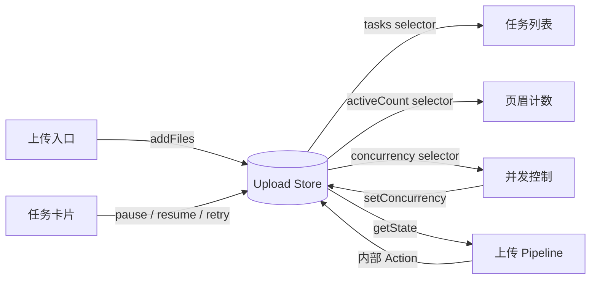
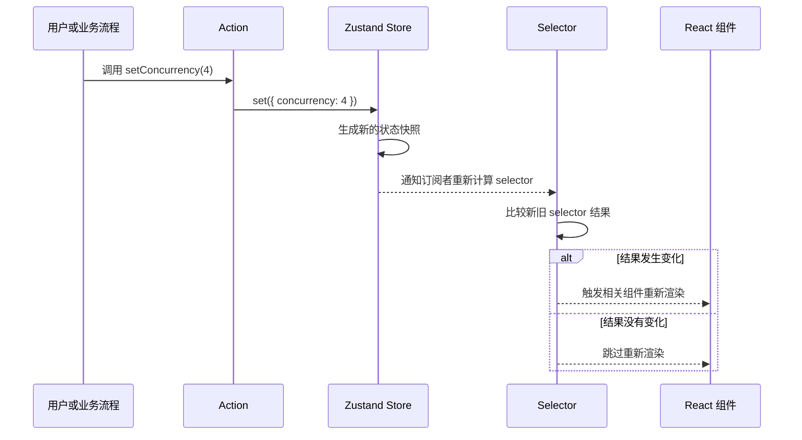
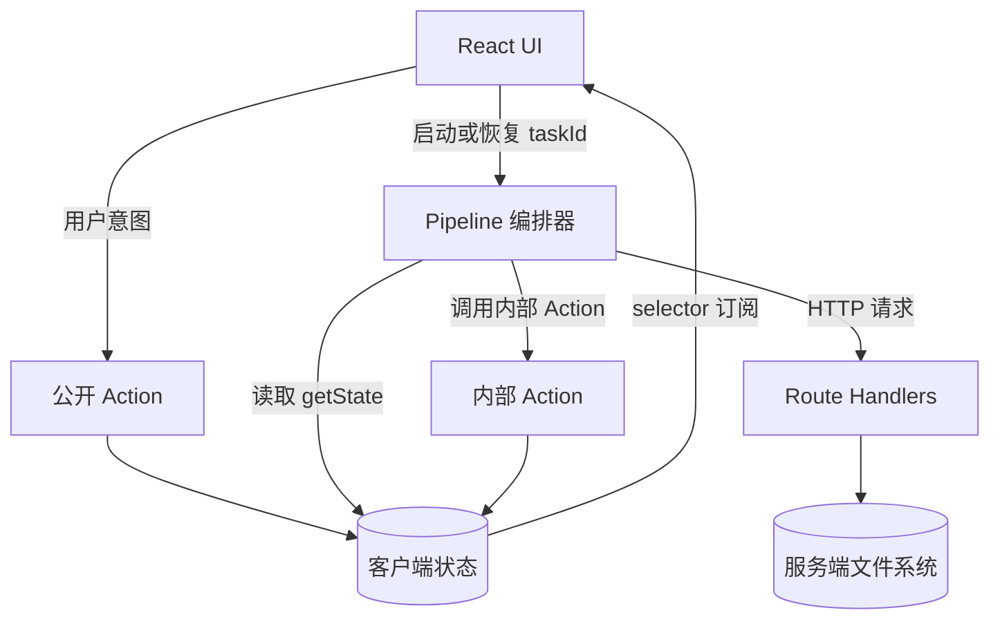

# Zustand 引入指导与实践指南

> 本文不是 Zustand API 清单，而是帮助开发者建立一套可落地的 Store 设计方法：先判断什么状态应该进入 Store，再设计 State、Action 和 Selector，最后以正确的订阅方式接入 React。

## 1. Zustand 是什么？

[Zustand](https://zustand.docs.pmnd.rs/) 是一个轻量的 React 状态管理库。它把共享状态保存在 React 组件树之外的 Store 中，并提供：

- `create`：创建同时具备 React Hook 和 Store API 的 Store；
- `set`：更新 Store 中的状态；
- `get`：在 Action 内读取最新状态；
- selector：让组件只订阅自己需要的状态片段；
- `getState`、`setState`、`subscribe`：允许 React 之外的业务模块访问或监听 Store。

最重要的心智模型是：

```text
Store = 当前状态快照（State）+ 修改状态的入口（Action）+ 状态变化订阅能力
```

Zustand 不要求使用 reducer、action type 或 Provider。简单场景下，一个 `create()` 就能得到可在组件中使用的 Hook；复杂场景仍然需要开发者主动设计数据边界和 Action 语义。

## 2. 为什么本项目引入 Zustand？

`next-upload` 的上传任务不是某一个组件的局部状态，而是一组跨组件、长生命周期的客户端任务：

- 上传入口负责创建任务；
- 任务列表展示全部任务；
- 任务卡片执行暂停、恢复、重试和删除；
- 页眉统计活跃任务数；
- 并发控制组件读取和修改全局并发数；
- 上传 pipeline 在 React 之外持续推进 hash、检查、上传和合并状态。

如果把这些状态分别保存在多个组件的 `useState` 中，就需要逐层传递数据和回调，还容易出现多个组件各自维护一份任务状态的问题。Zustand 让这些模块共享同一个状态源，同时允许每个组件只订阅需要的部分。



因此，本项目选择 Zustand 的核心原因不是“替代所有 `useState`”，而是集中管理需要被多个 UI 和非 React 模块共同访问的客户端上传状态。

### 安装与文件位置

在 `next-upload` 包中安装：

```bash
pnpm -C packages/next-upload add zustand
```

Store 应按业务域放置，而不是把所有全局状态堆进一个文件。本项目的上传 Store 位于 `packages/next-upload/lib/upload/store.ts`，任务协议与状态类型位于 `packages/next-upload/types/upload.ts`。如果以后增加彼此无关的业务域，应建立独立 Store。

## 3. Zustand 的运行原理

### 3.1 创建 Store

`create` 接收一个 State Creator。State Creator 通常返回一个对象，其中既有数据，也有修改数据的 Action：

```ts
import { create } from "zustand";

interface CounterStore {
  count: number;
  increment: () => void;
}

export const useCounterStore = create<CounterStore>((set) => ({
  count: 0,
  increment: () => set((state) => ({ count: state.count + 1 })),
}));
```

这里的 `useCounterStore` 同时具有两种身份：

1. React Hook：`useCounterStore(selector)` 会让组件订阅 selector 的结果；
2. Store API：`useCounterStore.getState()` 可在事件处理器或普通 TypeScript 模块中读取最新状态。

### 3.2 一次状态更新发生了什么？



默认情况下，selector 的新旧返回值使用 `Object.is` 判断是否相同。因此，选择一个稳定的原始值或对象引用很重要。

```tsx
// 推荐：组件只订阅 concurrency。
const concurrency = useUploadStore((state) => state.concurrency);

// 不推荐：订阅整个 Store，任何字段变化都可能让组件重新渲染。
const store = useUploadStore();
```

### 3.3 `set` 是浅合并，不是深合并

对于对象形态的 Store，`set` 默认把返回对象与顶层 State 浅合并：

```ts
set({ concurrency: 4 });
```

这只替换 `concurrency`，不会删除 `tasks` 和 Action。但嵌套对象不会自动深合并，更新时需要显式创建新的对象：

```ts
interface ProfileStore {
  profile: {
    name: string;
    preferences: { compact: boolean };
  };
  setCompact: (compact: boolean) => void;
}

const useProfileStore = create<ProfileStore>((set) => ({
  profile: {
    name: "Ada",
    preferences: { compact: false },
  },
  setCompact: (compact) =>
    set((state) => ({
      profile: {
        ...state.profile,
        preferences: {
          ...state.profile.preferences,
          compact,
        },
      },
    })),
}));
```

## 4. 从需求到 Store：一套可复用的设计步骤

### 第一步：先判断状态是否应该进入 Store

适合放入 Zustand 的状态：

- 需要被多个相距较远的组件共享；
- 需要跨组件卸载继续存在；
- 需要被 React 之外的流程读取或修改；
- 属于同一业务状态机，需要统一约束状态转换。

不应默认放入 Zustand 的状态：

- 仅一个组件使用的展开、悬停或临时输入状态，可优先使用 `useState`；
- 服务端权威数据，应由服务端数据获取与缓存方案管理，避免无意义复制；
- 可由现有 State 直接计算出的值，优先写成 selector，而不是再存一份；
- 不可安全共享到服务器请求之间的数据，不应放进服务端模块级全局 Store。

判断原则可以简化为：状态应该由谁拥有、谁能修改、谁需要订阅，以及它何时失效。

### 第二步：分开描述 State 与 Action

先设计数据，再设计允许发生的业务操作：

```ts
type TaskStatus = "idle" | "uploading" | "paused" | "completed" | "failed";

interface UploadState {
  tasks: Map<string, UploadTask>;
  concurrency: number;
}

interface UploadActions {
  addTask: (task: UploadTask) => void;
  pauseTask: (id: string) => void;
  setConcurrency: (value: number) => void;
}

type UploadStore = UploadState & UploadActions;
```

这样做的价值在于：State 回答“系统现在是什么状态”，Action 回答“外部被允许怎样改变状态”。UI 不必知道底层数据结构如何更新，TypeScript 也能同时约束数据与操作参数。

Action 应使用业务语言命名，例如 `pauseTask(id)`，而不是把 `set({ ... })` 分散到组件中。这样，状态转换规则集中在 Store 内部，组件只表达用户意图。

### 第三步：提供初始 State

初始值必须与类型和业务语义一致：

```ts
const initialState: UploadState = {
  tasks: new Map(),
  concurrency: 3,
};
```

推荐将可序列化的默认状态提取为独立常量或工厂函数，便于测试重置。`File`、`AbortController`、`Map`、`Set` 等运行时对象不能直接按普通 JSON 持久化，需要单独设计序列化策略。

### 第四步：用 `set` 添加数据和实现 Action

当新状态依赖旧状态时，使用函数形式的 `set(state => nextState)`：

```ts
export const useUploadStore = create<UploadStore>((set) => ({
  tasks: new Map(),
  concurrency: 3,

  addTask: (task) =>
    set((state) => {
      const nextTasks = new Map(state.tasks);
      nextTasks.set(task.id, task);
      return { tasks: nextTasks };
    }),

  pauseTask: (id) =>
    set((state) => {
      const task = state.tasks.get(id);
      if (!task || task.status !== "uploading") return state;

      const nextTasks = new Map(state.tasks);
      nextTasks.set(id, { ...task, status: "paused" });
      return { tasks: nextTasks };
    }),

  setConcurrency: (value) =>
    set({ concurrency: Math.max(1, Math.min(8, value)) }),
}));
```

这个示例体现了三条重要规则：

1. 基于旧值更新时使用函数式 `set`，避免依赖过期快照；
2. 在 Action 内校验业务条件，例如只有上传中的任务可以暂停；
3. 为 `Map` 创建新引用，确保订阅者能够观察到变化。

### 第五步：需要读取最新状态时使用 `get`

State Creator 的第二个参数 `get` 用于 Action 内读取当前 Store：

```ts
interface QueueStore {
  pending: string[];
  canStart: () => boolean;
  startNext: () => string | null;
}

const useQueueStore = create<QueueStore>((set, get) => ({
  pending: [],
  canStart: () => get().pending.length > 0,
  startNext: () => {
    const [nextId, ...rest] = get().pending;
    if (!nextId) return null;

    set({ pending: rest });
    return nextId;
  },
}));
```

如果只是根据旧 State 计算新 State，优先在一次函数式 `set` 中完成。`get` 更适合一个 Action 需要读取多个字段、调用判断逻辑或返回结果的场景。

### 第六步：通过 selector 消费状态

组件应订阅最小必要状态：

```tsx
export function ConcurrencyControl() {
  const concurrency = useUploadStore((state) => state.concurrency);
  const setConcurrency = useUploadStore((state) => state.setConcurrency);

  return (
    <input
      type="range"
      min={1}
      max={8}
      value={concurrency}
      onChange={(event) => setConcurrency(Number(event.target.value))}
    />
  );
}
```

派生值也应通过 selector 计算：

```ts
export const selectActiveCount = (state: UploadStore): number => {
  let count = 0;

  for (const task of state.tasks.values()) {
    if (["hashing", "checking", "uploading", "merging"].includes(task.status)) {
      count += 1;
    }
  }

  return count;
};
```

```tsx
const activeCount = useUploadStore(selectActiveCount);
```

不要把 `activeCount` 同时保存为 State。否则每次任务状态变化时都要同步更新两份数据，容易产生不一致。

## 5. Selector 与重新渲染

### 5.1 为什么不要直接返回新对象？

Zustand v5 默认用 `Object.is` 比较 selector 的新旧结果。下面的 selector 每次都会创建新对象：

```tsx
// 不推荐：每次计算都会得到新的对象引用。
const values = useUploadStore((state) => ({
  concurrency: state.concurrency,
  setConcurrency: state.setConcurrency,
}));
```

可以拆成两个 selector：

```tsx
const concurrency = useUploadStore((state) => state.concurrency);
const setConcurrency = useUploadStore((state) => state.setConcurrency);
```

确实需要一次返回多个字段时，使用 `useShallow`：

```tsx
import { useShallow } from "zustand/react/shallow";

const { concurrency, setConcurrency } = useUploadStore(
  useShallow((state) => ({
    concurrency: state.concurrency,
    setConcurrency: state.setConcurrency,
  })),
);
```

`useShallow` 只进行浅层比较。如果 selector 返回的嵌套数据内部被原地修改，它仍然无法可靠判断变化，因此不可变更新仍是基础。

### 5.2 Selector 的设计原则

- 返回组件真正需要的最小数据；
- 简单派生值可以即时计算，不急于缓存；
- 跨组件复用的业务派生逻辑，导出具名 selector；
- 避免在 selector 中执行网络请求、写 Store 或产生其他副作用；
- 返回对象、数组、`Map` 或 `Set` 时关注引用稳定性。

## 6. React 内外的两种访问方式

### 6.1 React 组件中：使用 Hook + selector

```tsx
const tasks = useUploadStore((state) => state.tasks);
```

这是响应式读取。`tasks` 的引用变化后，组件会重新渲染。

### 6.2 React 之外：使用 `getState()`

```ts
export async function runTask(taskId: string) {
  const store = useUploadStore.getState();
  const task = store.tasks.get(taskId);

  if (!task) return;

  store._setStatus(taskId, "checking");
  // 继续执行异步上传流程……
}
```

这是命令式读取，不会让调用它的代码自动响应后续变化。如果异步流程跨越多个 `await`，需要最新状态时应再次调用 `getState()`，不要长期持有旧的 State 快照。

本项目正是利用这个能力，让 `pipeline.ts` 在 React 之外推进上传流程，同时让组件通过 selector 自动获得最新视图。

## 7. 本项目 Store 的职责边界

| 模块 | 负责什么 | 不负责什么 |
| --- | --- | --- |
| `store.ts` | 保存客户端任务状态、校验状态转换、暴露 Action 和 selector | 不直接发送上传请求 |
| `pipeline.ts` | 编排 hash、检查、分片上传、重试与合并 | 不维护第二份任务状态 |
| React 组件 | 展示 selector 结果、把用户意图交给 Action | 不直接修改任务对象 |
| Route Handler / 文件系统 | 保存服务端分片和合并文件 | 不依赖浏览器中的 Zustand Store |



公开 Action（如 `pauseTask`）表达用户可以发起的业务操作；以下划线开头的内部 Action（如 `_setHashProgress`）只供 pipeline 报告执行进度。这个命名约定不是 Zustand 强制要求，而是本项目用于明确写入权限的设计。

Store 与 pipeline 分离还能避免相互导入：Action 更新状态并返回必要结果，由调用方决定是否启动 `runTask(id)`。

## 8. `Map`、`Set` 和嵌套对象的更新规则

不要直接修改 Store 中已有的集合引用：

```ts
// 错误：原 Map 引用没有变化。
state.tasks.set(task.id, task);
return { tasks: state.tasks };
```

应创建新集合：

```ts
// 正确：返回新的 Map 引用。
const nextTasks = new Map(state.tasks);
nextTasks.set(task.id, task);
return { tasks: nextTasks };
```

更新 `Set` 同理：

```ts
const nextUploaded = new Set(task.uploadedIndices);
nextUploaded.add(chunkIndex);

const nextTask = {
  ...task,
  uploadedIndices: nextUploaded,
};
```

本质上，更新路径上的每一层都要产生正确的新引用，才能让依赖引用比较的 selector 稳定工作。

## 9. 异步 Action 应怎样设计？

Zustand 允许 Action 为异步函数：

```ts
interface UserStore {
  loading: boolean;
  user: User | null;
  error: string | null;
  loadUser: (id: string) => Promise<void>;
}

const useUserStore = create<UserStore>((set) => ({
  loading: false,
  user: null,
  error: null,
  loadUser: async (id) => {
    set({ loading: true, error: null });

    try {
      const response = await fetch(`/api/users/${id}`);
      if (!response.ok) throw new Error("加载用户失败");
      const user = (await response.json()) as User;
      set({ user, loading: false });
    } catch (error) {
      set({
        loading: false,
        error: error instanceof Error ? error.message : "未知错误",
      });
    }
  },
}));
```

但“可以写在 Store 中”不等于“所有异步流程都应该写进去”：

- 短小、只服务于一个 Store 的请求，可以作为异步 Action；
- 包含并发池、重试、取消和多个协议阶段的流程，适合放在独立 service 或 pipeline；
- 无论放在哪里，Store 都应是客户端状态的单一事实来源，避免流程模块再维护一份可变状态。

## 10. Next.js 中的注意事项

Zustand Store 通常是模块级状态。Next.js 服务端可同时处理多个请求，因此不能把带有用户数据的全局 Store 当作服务端请求状态容器。

在本项目中应遵守：

- 上传 Store 只在客户端使用，Store 文件声明 `"use client"`；
- React Server Component 不读取或修改该 Store；
- 不要在服务端渲染期间访问 `File`、`window` 或 `AbortController` 等浏览器对象；
- 如果未来需要服务端初始化且与请求相关的 Zustand State，应使用“每个请求创建一个 Store + Provider 注入”的方式，并保证服务端与客户端初始数据一致；
- 使用 `persist` 时注意 hydration 时机，也不要直接持久化 `File`、`AbortController`、`Map` 或 `Set`。

## 11. 常见错误

### 错误一：在组件中直接修改对象

```ts
const task = useUploadStore.getState().tasks.get(id);
if (task) task.status = "paused";
```

这绕开了 Action 和订阅通知。正确做法是调用 `pauseTask(id)`。

### 错误二：订阅整个 Store

```tsx
const store = useUploadStore();
```

这会扩大组件的更新范围。应通过 selector 读取具体字段。

### 错误三：把派生数据重复存储

同时保存 `tasks` 和 `activeTaskCount` 会产生同步成本。应从 `tasks` 派生计数。

### 错误四：把 `getState()` 当成响应式 Hook

```tsx
const count = useUploadStore.getState().tasks.size;
```

这次读取不会建立 React 订阅。需要随状态变化更新 UI 时，应写成：

```tsx
const count = useUploadStore((state) => state.tasks.size);
```

### 错误五：在不同模块维护重复状态

pipeline、组件和 Store 各自保存一份任务进度，会让状态无法可靠对齐。应由 Store 保存状态，其余模块读取或提交 Action。

## 12. 测试与评审清单

- [ ] State 是否只有一个明确的事实来源？
- [ ] Action 名称是否表达业务意图，而不是底层赋值细节？
- [ ] Action 是否阻止非法状态转换和越界输入？
- [ ] 基于旧值的更新是否使用函数式 `set`？
- [ ] 对象、数组、`Map`、`Set` 是否进行了不可变更新？
- [ ] 派生值是否由 selector 计算，避免重复存储？
- [ ] 组件是否只订阅真正使用的数据？
- [ ] selector 返回复合值时，引用是否稳定或是否需要 `useShallow`？
- [ ] React 外部代码是否在需要最新值时重新调用 `getState()`？
- [ ] 异步失败、取消、重试和终态是否都有明确语义？
- [ ] Next.js 服务端与客户端的状态边界是否清楚？
- [ ] 持久化数据是否可序列化且不会导致 hydration 不一致？

## 13. 项目代码入口与官方资料

项目代码：

- [`packages/next-upload/lib/upload/store.ts`](../../packages/next-upload/lib/upload/store.ts)：Store、Action 和 selector 的完整实现；
- [`packages/next-upload/lib/upload/pipeline.ts`](../../packages/next-upload/lib/upload/pipeline.ts)：React 之外通过 `getState()` 驱动 Store；
- [`packages/next-upload/types/upload.ts`](../../packages/next-upload/types/upload.ts)：任务数据和状态机类型；
- [`packages/next-upload/components/ConcurrencyControl.tsx`](../../packages/next-upload/components/ConcurrencyControl.tsx)：组件通过 selector 读取 State 与 Action。

官方资料：

- [Zustand 官方文档](https://zustand.docs.pmnd.rs/)
- [`create` API](https://zustand.docs.pmnd.rs/reference/apis/create.html)
- [更新 State](https://zustand.docs.pmnd.rs/learn/guides/updating-state.html)
- [使用 `useShallow` 避免不必要渲染](https://zustand.docs.pmnd.rs/learn/guides/prevent-rerenders-with-use-shallow.html)
- [Next.js 使用指南](https://zustand.docs.pmnd.rs/learn/guides/nextjs.html)
